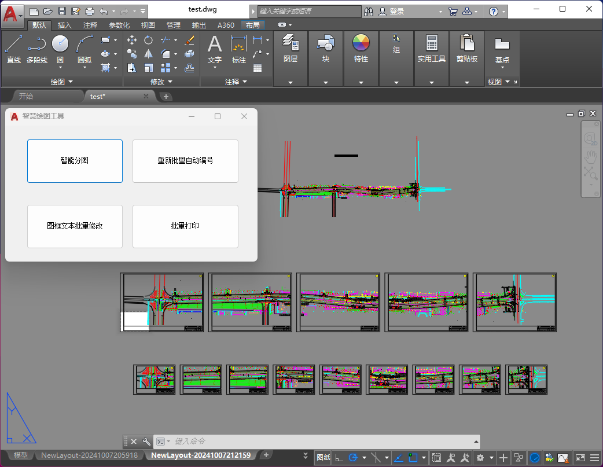

# AICAD —— 基于AI的市政设计软件辅助系统
 

- **项目介绍**: 
本项目旨在于现有市政设计软件基础上，引入人工智能技术以实现市政设计任务中的智能绘图功能，从而提高市政设计的效率和精准度。项目包括进行详细的需求分析、引入适用的AI技术、对AI模型的研究和训练、软件的开发与集成、以及项目总结和成果验收。

- **功能目标**: 
  - 路口识别与智能分图：通过AI技术，精准识别设计图中的路口，从而进行合理分图。
  - 图框批量化替换：简化人工图框替换流程，提高工作效率。
  - 文本输入自动化：自动化处理文本输入工作，减少人工操作耗时。
  - 批量化打印：实现设计图纸的批量打印，进一步提高工作效率。

- **成果展示**：

  

